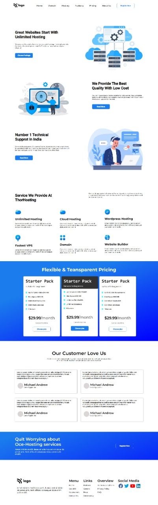

# Project-11-  Websting Hosting Page Template.
 ## Hey there ,  I am Amarjeet 
 I have built a template of HTML and CSS project using my core css skills.
 
 
 
 

 My Live Deployed Website Link:- [Click here!](https://project-12-comapny-home-page-template.netlify.app/)

 
 

 ## It took almost 9 hours to be completed.

 ## What I learned from this project 
 - Most important thing which I learned from this project is about position.
  - How to add logo like twitter , instagram , facebook , Youtube etc on my web page.
  - How can I change color of all the logo.
  - Also I explore more about flex box.
  - Hover effects